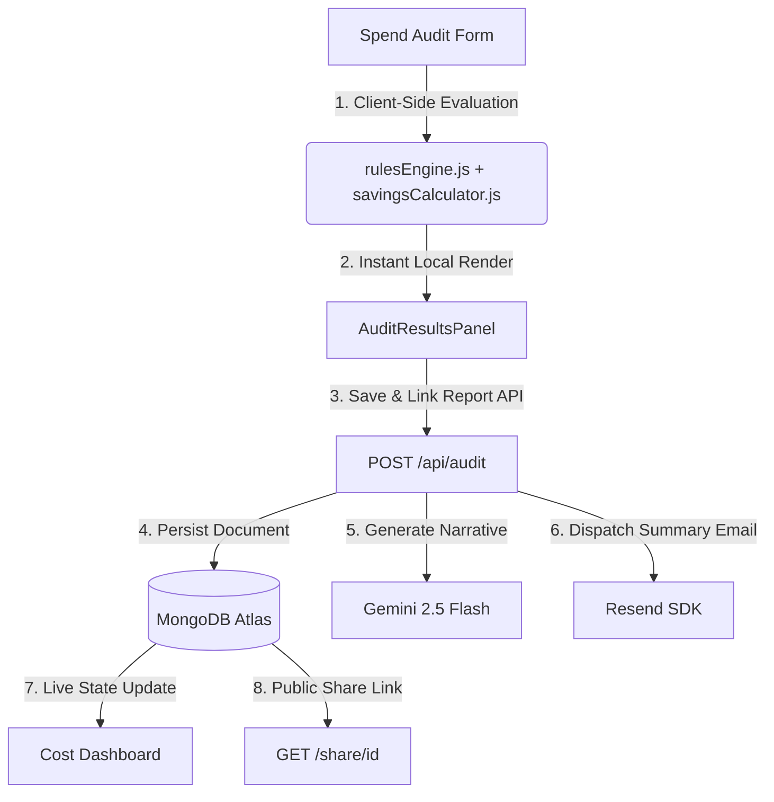

# CredLens

**AI spend optimization for teams that run on subscriptions.**

CredLens audits your AI tool stack — subscriptions, API usage, seat allocations — and surfaces actionable recommendations to cut waste, optimize pricing tiers, and recover runway. Built as a production-ready SaaS MVP with persistent audit reports, shareable links, and Gemini-powered executive summaries.

---

## Live Demo

🚀 [CredLens Live Platform](https://cred-lens-one.vercel.app/)

---

## Key Highlights

* **Rule-Based Spend Optimization Engine**: Evaluates stack configuration using deterministic financial rules to compute exact savings.
* **Gemini-Powered Audit Summaries**: Standardized to use the canonical `ai_audit_summary` model to generate short, CFO-grade financial summaries.
* **MongoDB Atlas Persistence**: Structured Mongoose schemas to store and link reports, enabling public sharing.
* **Real-Time Dashboard Synchronization**: Dynamically invalidates stale caches using same-tab custom window events and cross-tab storage listeners.
* **Professional PDF & CSV Exports**: Seamless client-side export workflows for easy finance team reporting.
* **Resend-Powered Email Delivery**: Transactional email pipeline to deliver professional audit summaries directly to business inbox.
* **SaaS Subscription Hub**: Modern onboarding seat footprint profiling and waitlist portal.

---

## The Problem

Engineering teams paying for multiple AI subscriptions rarely know which ones actually get used, which plans are over-provisioned, or where API token budgets are silently inflating. CredLens gives you the same visibility a CFO would ask for — without requiring a CFO.

---

## Core Features

| Feature | Description |
|---|---|
| **AI Spend Audit** | Rule-based engine that evaluates tool overlap, plan tier fit, seat utilization, and API efficiency |
| **Optimization Recommendations** | Prioritized (High / Medium / Low) cards with specific dollar savings and actionable steps |
| **Gemini Executive Summary** | AI-generated narrative that contextualizes the audit for non-technical stakeholders |
| **MongoDB Persistence** | Audit reports saved to Atlas with full schema — shareable, retrievable, permanent |
| **Shareable Reports** | Public `/share/[id]` routes render a clean read-only audit view from any device |
| **Transactional Email** | Resend delivers a professional audit summary to the user's business email on save |
| **Subscriptions Hub** | Beta feature page showcasing SaaS seat management and renewal intelligence |
| **Cost Optimization Dashboard** | AI spend telemetry view with metric cards, redundancy alerts, and runway recovery insights |

---

## Product Walkthrough

Below are the key modules reflecting the production-grade CredLens workflow.

### 1. Interactive Spend Audit Form

*A multi-step onboarding ingest form featuring per-step schema validation (via Zod), localStorage form state resume, and smooth CSS transitions.*

### 2. Financial Audit Results Panel

*An executive-grade financial summary detailing current spend, optimized spend, monthly savings, and runway extension impact, paired with prioritized optimization cards.*

### 3. CFO-Style AI Audit Summary

*Consolidated financial narrative generated by Gemini 2.5 Flash, summarizing operational context, high-impact alerts, and runway preservation recommendations.*

### 4. Telemetry Cost Dashboard

*A unified SaaS dashboard showcasing live cost efficiency scorecards, telemetry charts, redundancy alerts, and a real-time event feed synchronized with MongoDB.*

### 5. Secure Shareable Reports

*Public read-only reports hosted at `/share/[id]`, enabling instant dashboard updates and easy stakeholder link-sharing without authentication barriers.*

### 6. Subscriptions Hub

*Interactive seat profiling and renewal intelligence portal with waitlist capture, supported by Resend confirmation email alerts.*

---

## Tech Stack

| Layer | Technology |
|---|---|
| Framework | Next.js 16 (App Router) |
| Language | JavaScript (ES Modules) |
| Styling | Tailwind CSS v4 + shadcn/ui |
| Forms | React Hook Form + Zod |
| Database | MongoDB Atlas via Mongoose |
| AI Provider | Google Gemini 2.5 Flash (`@google/generative-ai`) |
| Email | Resend SDK |
| Deployment | Vercel |

---

## Architecture & Data Flow

### Codebase Map
```
app/
├── page.js                  # Main audit flow (form + results, localStorage persistence)
├── dashboard/               # Cost Optimization Dashboard (force-dynamic, live refetching)
├── subscriptions/           # SaaS Subscription Hub (beta waitlist)
├── share/[id]/              # Public read-only shared report
├── api/
│   ├── audit/               # POST — run audit, persist to MongoDB, trigger email
│   ├── leads/               # POST — capture business email + link audit
│   └── beta-requests/       # POST — save beta access request, send Resend confirmation
│   └── dashboard/           # GET — fetch derived dashboard payload (uncached)

lib/
├── audit/
│   ├── rulesEngine.js       # 10 composable audit rules (AuditRule base class + subclasses)
│   ├── savingsCalculator.js # Pure math: sanitization, clamping, per-rule savings formulas
│   └── explanationBuilder.js# Recommendation copy catalog + structured output builder
├── ai/
│   ├── aiService.js         # Provider-agnostic AI dispatch layer
│   ├── providers/           # Gemini + mock provider implementations
│   └── prompts.js           # Structured audit summary prompt templates
├── email/                   # Resend integration, email template builders
└── db.js                    # Mongoose connection singleton with pooling

models/
├── Audit.js                 # Full audit schema: inputs, recommendations, summary, metadata
├── Lead.js                  # Business email + company capture linked to auditId
├── BetaRequest.js           # Subscription Hub beta waitlist
└── Subscription.js          # Future: recurring subscription tracking

components/
├── forms/SpendAuditForm/    # Multi-step form (ToolSelection, SpendMetrics, UseCaseSelection)
├── results/                 # AuditResultsPanel, AuditOverviewSection, RecommendationCard
├── audit/                   # AuditPreviewCard, ProviderIcon, MetricItem
└── dashboard/               # MetricCard, TelemetryChart, RedundancyAlerts, InsightFeed
```

### Data Orchestration Flow



---

## Engineering Decisions

* **Deterministic Math Over LLM Guesswork**:
  Savings calculations happen in `lib/audit/rulesEngine.js` — pure, unit-tested JavaScript. We deliberately separated calculation logic from the LLM summary generation because LLMs are unreliable at precise financial arithmetic. The AI (Gemini) only receives the computed metrics and creates the plain-English summary, keeping the math auditable and correct.

* **Explicit Boundaries & Clamping**:
  The `buildSavingsResult` utility enforces hard minimum/maximum bounds on all calculated metrics. Floating-point edge cases and extreme input combinations otherwise silently produce negative savings or invalid percentages, which would destroy user trust.

* **Decoupled Messaging & Math**:
  `explanationBuilder.js` owns all human-readable copy (recommendation titles, `whyItMatters` text, `actionableSteps`), while `savingsCalculator.js` handles only pure numbers. This decoupling allows quick copy changes or localization without touching core financial rules.

* **Server-Side Transactional Emailing**:
  Email delivery runs entirely server-side through Next.js Route Handlers. The Resend API key is never exposed to the client bundle, establishing a secure and production-grade delivery pipeline.

* **Schema-First Report Persistence**:
  Audit results are persisted in MongoDB Atlas with their full input payload, computed recommendations, AI summary, and metadata. This design makes the shared report route trivial (`GET /share/[id]` just queries Mongoose) and sets up simple database workflows for user profiles and history.

* **Pluggable AI Decoupling Strategy**:
  `lib/ai/aiService.js` routes prompt requests to whichever provider is specified in `AI_PROVIDER`. The fallback to a high-fidelity local mock generator in development preserves API quota and allows fully offline development.

---

## Local Setup

**Prerequisites:** Node.js 20+, a MongoDB Atlas cluster, a Gemini API key (optional for dev), a Resend API key (optional for dev).

```bash
# 1. Clone the repo
git clone https://github.com/Himanshu2631/CredLens.git
cd CredLens

# 2. Install dependencies
npm install

# 3. Configure environment
cp .env.example .env.local
# Fill in your values (see below)

# 4. Start the dev server
npm run dev
```

### Environment Variables

```bash
# .env.local

# MongoDB Atlas connection string
MONGODB_URI=mongodb+srv://<username>:<password>@cluster0.example.mongodb.net/credlens

# Gemini API key — leave blank to use the mock AI provider
GEMINI_API_KEY=

# AI provider: 'gemini' | 'mock'  (default: 'mock' when key is absent)
AI_PROVIDER=mock

# Resend API key — email delivery is silently skipped if not set
RESEND_API_KEY=re_...

# Sender address (must be verified in your Resend account)
RESEND_FROM_EMAIL=audit@yourdomain.com
```

### Run Tests

```bash
npm test
```

78 assertions across 8 test suites covering the savings calculator, audit engine rules, pricing utilities, DB connectivity, AI summary generation, beta request flow, email delivery, and dashboard compilation.

---

## Deployment

CredLens deploys to Vercel with zero configuration beyond environment variables.

```bash
# Deploy via Vercel CLI
npx vercel --prod
```

Set the following in your Vercel project settings under **Environment Variables**:

* `MONGODB_URI`
* `GEMINI_API_KEY`
* `AI_PROVIDER` → `gemini`
* `RESEND_API_KEY`
* `RESEND_FROM_EMAIL`

**Production considerations:**
* MongoDB Atlas connection pooling is handled by the singleton in `lib/db.js` — no extra configuration needed for Vercel's serverless functions
* Resend API key must be server-side only — never prefix with `NEXT_PUBLIC_`
* The `AI_PROVIDER=mock` fallback means the app stays functional in environments without a Gemini key (summaries are static but data is real)

---

## Future Roadmap

The following future milestones are planned to transition the MVP into a comprehensive enterprise SaaS platform:

* **Audit History Ledger**: Implement full user session models and a `/reports` history page for tracking stack audits over time.
* **Enterprise Authentication**: Secure SSO integrations (NextAuth, GitHub/Google OAuth) and role-based workspace management.
* **Slack Cost Alerts Webhook**: Dispatch automated alerts and cost saving suggestions directly to configured team Slack channels on audit completion.
* **Recurring Audit Cron Engine**: Trigger automated cost audits on a monthly schedule against saved stacks, alerting administrators if SaaS vendor pricing updates impact their stack.
* **Active Subscription Telemetry**: Direct API integrations to fetch real-time seat counts, active seats, and usage metrics from tools like Slack, OpenAI, and Cursor.

---

## Project Structure Notes

* `data/pricing.js` — Central pricing registry for all supported AI tools. Adding a new tool means adding one entry here; the audit engine picks it up automatically.
* `lib/audit/rulesEngine.js` — Each rule is a class extending `AuditRule`. New rules are additive — no existing logic changes.
* `components/results/` — All post-audit UI. The panel is fully decoupled from the form; it only needs a valid `auditResult` object.

---

## License

MIT
